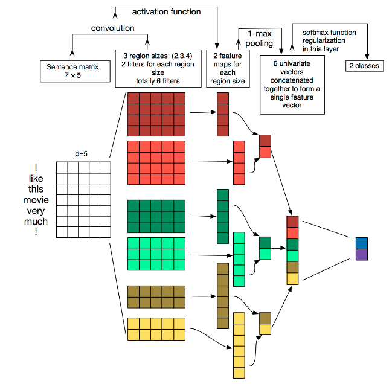

# Exercise-FudanNLPbeginner

复旦邱锡鹏老师的自然语言处理入门练习作业💻

写的过程中参考了不少资料，在此一并感谢🙏！

# Task 1 NumPy文本分类

## 分析

多分类问题（分成5类）C=5

数据集：Kaggle 影评情感分析  

流程：

（1）特征表示：tri-gram的词袋模型

得到一个列表，长度V

以单词为单位，抽取数据集文本中包含的所有一元集、二元相邻集、三元相邻集

（2）学习器：logistic回归（二分类）—>  softmax回归（多分类）

$$
\hat{y} =\arg \max^{C}_{c=1} \omega^{T}_{c} x
$$

omega，5个权重向量，长度V

（3）训练：交叉熵损失

评估损失情况：风险函数（交叉熵损失），评分，判断是否继续

调参：-1 * 风险函数的梯度 * 学习率

---

数据集：

自行下载原数据集存储至Dataset/train.tsv、Dataset/test.tsv

---

## 实战

特征表示.ipynb

处理原数据集内容，获取特征，保存至list1.csv，list2.csv，list3.csv

Softmax回归.ipynb

实现基于numpy的softmax回归，写得较一般 0.0

---

可作实验：

shuffle ：打乱序列里的元素，随机排列

参数更新：batch  遍历全部数据集算一次Loss

​					mini-batch  数据集分拆成小批量，按小批量更新参数

---

## 总结

效果只有0.44   : (  ，很差

改进：

1.数据集的存取方式，pandas.DataFrame有些细节没处理好

2.数据集的处理，可以把训练集和测试集分清

3.主要函数的参数输入没弄好，不方便单条数据测试

4.函数运行效率优化（特征向量采用字典？）

由于之后主要采用各类框架，任务1不准备作进一步优化了。

# Task 2  TextCNN文本分类

## 分析

PyTorch重写Task1

流程：

（1）词嵌入 Word Embedding：使用word2vec？

文本表示的类型：

- 基于one-hot、tf-idf、textrank等的bag-of-words；
- 主题模型：LSA（SVD）、pLSA、LDA；
- 基于词向量的固定表征：word2vec、fastText、glove
- 基于词向量的动态表征：ELMO、GPT、bert

（2）CNN/RNN的分类器

（3）训练

---

## 实战

### Dataprocess.ipynb 处理数据集

#### 1 构造 word embedding字典

1.1

根据编号，train.tsv和test.tsv 共222352条phrase

将这些短句分割为单词，全部字母小写化，得到19479个词(或标点)。

根据出现频率倒序储存在字典列表wordFreq中，保存于文件Dateset/wordFreq.jsonl

1.2

将word embedding字典存储，word<—>序号

保存于文件Dataset/word_To_num.json、Dataset/num_To_word.json

#### 2 转换成jsonl格式，分割数据集

2.1

原格式：tsv 有PhraseId、SentenceId、Phrase、Sentiment

现格式： (使用pandas库，这里要先把几个数字转化为字符串储存，在单独转化为数字)

```json
{
  "PhraseId":, //超过int16范围，转换为字符串
  "SentenceId":,
  "Phrase":" ",
  "Sentiment": //0-4间的整数，2无情感，4为喜欢，0为讨厌
}
```

2.2

短句共156060条

0-140453 为训练集 ，保存为 Dataset/train.jsonl

140454-156059 为测试集，保存为 Dataset/test.jsons

> 两数据集连接处可能有短句相叠，不够严谨，但无伤大雅。

---

### TextCNN.py



```python
import json

max=0
with open('Dataset/Dataset.jsonl','r') as f:
        for line in f:
            data=json.loads(line)
            temp=len(data['Phrase'].split(' '))
            if temp>max:
                max=temp;
print(max)
```

 据分析：Phrase最大句长为52，故设置矩阵高度为60

### 其余

#### TestModel.py

通过print查看训练流程中数据流动的格式变化，供初学者参考

#### 应用/

模型的使用示例

将TextCNN的代码框架初步搭建起来，应用在CCKS2022中Task8的比赛里

## 总结

经验：

（1）使用nn.Embedding将单词（.lower()小写化）转化为embedding格式

（2）神经网络结构是比较简单的，注意因为卷积核是4维的，数据输入也应该是4维。

（3）注意torch包内各函数接口采用的数据格式！！比如nn.CrossEntropyLoss()，标签必须是一维的，而非神经网络的输出（独热编码的形式）；同时标签还需是LongTensor格式，默认新建的似乎是FloatTensor格式。

很好的项目，可供参考：

https://github.com/649453932/Chinese-Text-Classification-Pytorch

# Task 3 文本匹配ESIM

## 分析

输入两个句子判断，判断它们之间的关系。参考ESIM（可以只用LSTM，忽略Tree-LSTM），用双向的注意力机制实现。

参考《神经网络与深度学习》第8章 注意力机制

文本蕴含识别（Recognizing textual entailment， RTE)

判断三种关系：

- Neutral （不相关）
- Contradiction（矛盾）
- Entailment （蕴含）

1. 注意力机制

​		（1）在所有输入信息上计算**注意力分布**

​		（2）根据**注意力分布**来计算输入信息的**加权平均**

2. token2token attetnion

### 数据集：斯坦福NLI

去除数据集中分类模糊的条目

train 550152条 —>549367条

dev  10000条 —> 9842条

test  10000条—> 9824条

```json
{
	"annotator_labels":[" "], //列表，可能含多个
  //列表元素有4种：'entailment','contradiction','neutral',''
	"captionID":" ",
	"gold_label":" ",
  //4种情况，'entailment','contradiction','neutral','-'
	"pairID":" ",
	"sentence1":" ",
	"sentence1_binary_parse":" ",
	"sentence1_parse":" ",
	"sentence2":" ",
	"sentence2_binary_parse":" ",
	"sentence2_parse":" "
}
```

## 实战

参考 https://github.com/zhaogaofeng611/TextMatch 构建了ESIM的代码框架

## 总结

注意力机制是该任务的安排的核心知识吧，算是Transformer的一个重要组成。

# Task 4

### 任务四：基于LSTM+CRF的序列标注

用LSTM+CRF来训练序列标注模型：以Named Entity Recognition为例。

1. 参考
   1. 《[神经网络与深度学习](https://nndl.github.io/)》 第6、11章
   2. https://arxiv.org/pdf/1603.01354.pdf
   3. https://arxiv.org/pdf/1603.01360.pdf
2. 数据集：CONLL 2003，https://www.clips.uantwerpen.be/conll2003/ner/
3. 实现要求：Pytorch
4. 知识点：
   1. 评价指标：precision、recall、F1
   2. 无向图模型、CRF
5. 时间：两周

## 分析

原始数据集似乎要找路透社发邮件申请？太麻烦了，

[ningshixian](https://github.com/ningshixian)/**[NER-CONLL2003](https://github.com/ningshixian/NER-CONLL2003)**  使用了此处提供的数据集


## 实战

参考了pytorch官方教程里的代码加以改进优化

https://pytorch.org/tutorials/beginner/nlp/advanced_tutorial.html#bi-lstm-conditional-random-field-discussion

{"B-PER": 0, "I-PER": 1, "B-LOC": 2, "I-LOC": 3, "B-MISC": 4, "I-MISC": 5, "B-ORG": 6, "I-ORG": 7, "O": 8, "<START>": 9, "<STOP>": 10}

## 总结


# Task 5

### 任务五：基于神经网络的语言模型

用LSTM、GRU来训练字符级的语言模型，计算困惑度

1. 参考
   1. 《[神经网络与深度学习](https://nndl.github.io/)》 第6、15章
2. 数据集：poetryFromTang.txt
3. 实现要求：Pytorch
4. 知识点：
   1. 语言模型：困惑度等
   2. 文本生成

## 分析

数据集已给出，简单纠个错就能用

模型结构也十分简单，虽然是最后一个任务，没太多难点分析。

可参考作业案例——Reference.ipynb

- 用LSTM、GRU来训练字符级的语言模型 https://zhuanlan.zhihu.com/p/356147399
- GRU模式没有问题，LSTM模式因h0不对，会报错。需要分别设置。

## 实战

1. 词嵌入层
2. LSTM/GRU的RNN层
3. 全连接层

## 总结

比较传统的语言模型，2018年后Bert出来后就实战作用不大了。

# 附加

## ConfigTEST/

研究了参数管理的3类方法，作以记录。

## RichTEST/

研究使用rich库改良命令行打印的简单进度条
